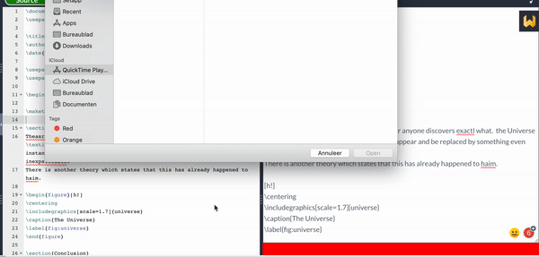

# About

Spellcheck in Overleaf is very basic. It is nothing compared to dedicated tools such as Grammarly. I used to copy and paste into Docs back and forward until recently. I created this chrome extension that copies the content of the file visible and the editor; filters the commands/keywords and pastes the plain text in a textarea (Right area). This textarea is displayed over the pdf preview. Extensions such as Grammarly can't check complex editors such as Overleaf, but only work in textareas. Changes made to the textarea, either by extensions such as Grammarly or yourself, are evaluated and changes are merged back to the editor.

# Donation
If this project saved you time, you can buy me a cup of coffee :)

# Instructions
  - Load the extension as explained here: https://developer.chrome.com/extensions/getstarted
  - Activate the plugin by clicking the plugin en enabling the checkbox.
  - Click the textarea to initialize spellcheck.
  
Note: the only known limitation is that the number of lines while editing CANNOT change. Inserting Enters in the textarea breaks merging back changes to the editor.

# Privacy
This plugin does not collect any data.

# TODO
  - Adding more filters.
  - Allow custom filter.
