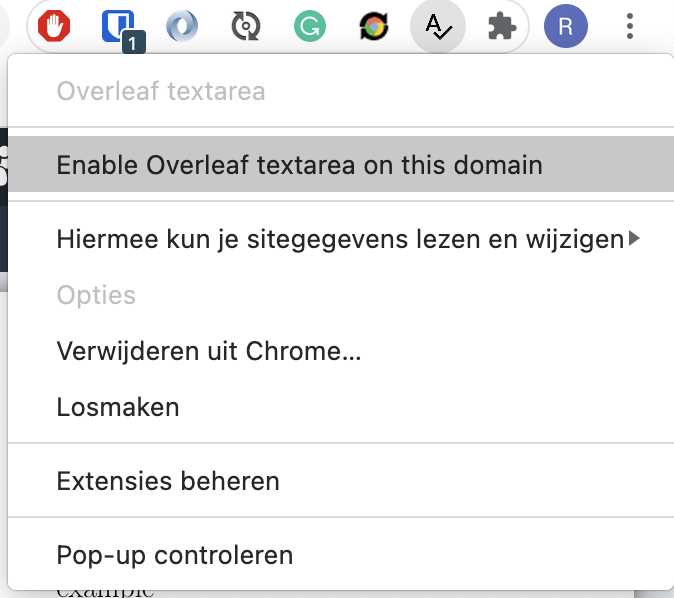
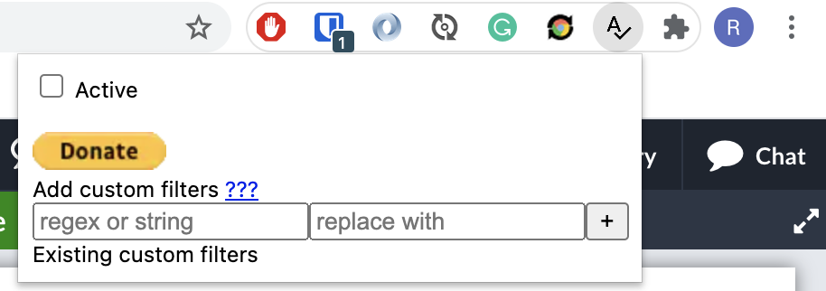

# About

Spellcheck in Overleaf is very basic. It is nothing compared to dedicated tools such as Grammarly. I used to copy and paste into Docs back and forward
until recently. I created this chrome extension that copies the content of the file visible and the editor; filters the commands/keywords and pastes
the plain text in a textarea (Right area). This textarea is displayed over the pdf preview. Extensions such as Grammarly can't check complex editors
such as Overleaf, but only work in textareas. Changes made to the textarea, either by extensions such as Grammarly or yourself, are evaluated and
changes are merged back to the editor.

# Donation

If this project saved you time, you can buy me a cup of coffee :)

# Instructions

- Install the plugin https://chrome.google.com/webstore/detail/overleaf-textarea/iejmieihafhhmjpoblelhbpdgchbckil
  or https://addons.mozilla.org/addon/overleaf-textarea/
- Optionally, pin the plugin    
- Optionally, when hosted on a other domain than overleaf.com, allow the plugin to run    
- Activate/deactivate the plugin by clicking the plugin en enabling the checkbox.    
- Click the textarea to initialize spellcheck.

Note: the only known limitation is that the number of lines while editing CANNOT change. Inserting Enters in the textarea breaks merging back changes
to the editor.

# Privacy

This plugin does not collect any data.

# Custom filters

You can add custom filters to filter latex command I forgot about or simply do not support.

You have to enter a regex or string and a replace value. For those of you who do not understand what regex and string means, head to the examples
below. Those should get your started.

For the more technical users, regexes you need to escape characters like \ as you would do as usual. For string there is no need to escape. This
filters works mostly like the JavaScript `replaceAll` function. More on that
here: https://developer.mozilla.org/en-US/docs/Web/JavaScript/Reference/Global_Objects/String/replaceAll

## Overriding default filters

Default filters can be overriden by user filters. This can be achieved by simply providing it as a custom filter. An example would be the default
filter `\_` which is replaced by `_`. This can be override with the following filter: `\_` with value `__`.

Default filters can also be disabled. This can be achieved by providing the value: `%%EMPTY%%`.

## Examples to get started

| Regex or string             | replace value | Latex text                                     | Result text                   |
| --------------------------- | ------------- | -----------------------------------------------|------------------------------ |
| /(\\\\author{)(.*?)(})/g    |               | \\author{it is me}                             |                               |
| /(\\\\author{)(.*?)(})/g    | $2            | \\author{it is me}                             | it is me                      |
| /(\\\\caption{)(.*?)(})/gs  | $2            | \\caption{this includes   a new line}       | this includes   a new line |
| \\_                         | _             | This is an\\_underscore                        | This is an_underscore         |
| a                           | b             | Example                                        | Exbmple                       |

# Known issues

- Don't use the rich text mode. Only use the source editor.
- Sometimes Grammarly is a bit buggy and places the wrong errors in wrong positions. A page refresh usually solves this.
- Some other plugins are conflicting. Try disabling them when you experience problems.

# Building
Requires nodejs 12 or higher.
Run `npm install`
Next, run the build or dev script in `package.json`
Load the extension https://developer.chrome.com/docs/extensions/mv3/getstarted/
